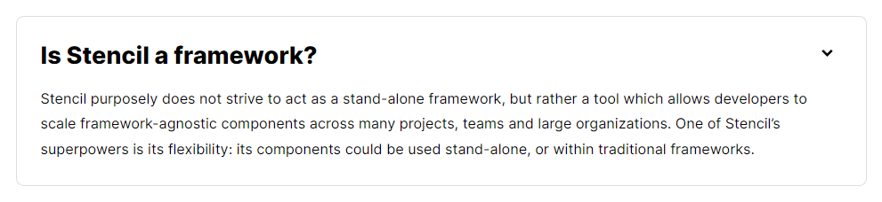
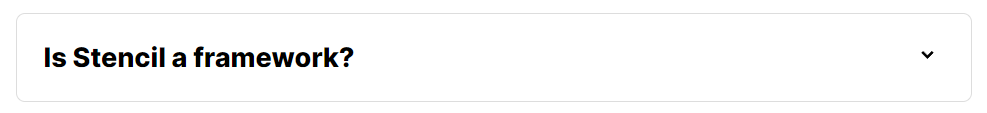

# Accordion Web Component Using Stencil with Sass

[![Built With Stencil](https://img.shields.io/badge/-Built%20With%20Stencil-16161d.svg?logo=data%3Aimage%2Fsvg%2Bxml%3Bbase64%2CPD94bWwgdmVyc2lvbj0iMS4wIiBlbmNvZGluZz0idXRmLTgiPz4KPCEtLSBHZW5lcmF0b3I6IEFkb2JlIElsbHVzdHJhdG9yIDE5LjIuMSwgU1ZHIEV4cG9ydCBQbHVnLUluIC4gU1ZHIFZlcnNpb246IDYuMDAgQnVpbGQgMCkgIC0tPgo8c3ZnIHZlcnNpb249IjEuMSIgaWQ9IkxheWVyXzEiIHhtbG5zPSJodHRwOi8vd3d3LnczLm9yZy8yMDAwL3N2ZyIgeG1sbnM6eGxpbms9Imh0dHA6Ly93d3cudzMub3JnLzE5OTkveGxpbmsiIHg9IjBweCIgeT0iMHB4IgoJIHZpZXdCb3g9IjAgMCA1MTIgNTEyIiBzdHlsZT0iZW5hYmxlLWJhY2tncm91bmQ6bmV3IDAgMCA1MTIgNTEyOyIgeG1sOnNwYWNlPSJwcmVzZXJ2ZSI%2BCjxzdHlsZSB0eXBlPSJ0ZXh0L2NzcyI%2BCgkuc3Qwe2ZpbGw6I0ZGRkZGRjt9Cjwvc3R5bGU%2BCjxwYXRoIGNsYXNzPSJzdDAiIGQ9Ik00MjQuNywzNzMuOWMwLDM3LjYtNTUuMSw2OC42LTkyLjcsNjguNkgxODAuNGMtMzcuOSwwLTkyLjctMzAuNy05Mi43LTY4LjZ2LTMuNmgzMzYuOVYzNzMuOXoiLz4KPHBhdGggY2xhc3M9InN0MCIgZD0iTTQyNC43LDI5Mi4xSDE4MC40Yy0zNy42LDAtOTIuNy0zMS05Mi43LTY4LjZ2LTMuNkgzMzJjMzcuNiwwLDkyLjcsMzEsOTIuNyw2OC42VjI5Mi4xeiIvPgo8cGF0aCBjbGFzcz0ic3QwIiBkPSJNNDI0LjcsMTQxLjdIODcuN3YtMy42YzAtMzcuNiw1NC44LTY4LjYsOTIuNy02OC42SDMzMmMzNy45LDAsOTIuNywzMC43LDkyLjcsNjguNlYxNDEuN3oiLz4KPC9zdmc%2BCg%3D%3D&colorA=16161d&style=flat-square)](https://stenciljs.com)

## Accordion Web Component Overview

**Accordion Web Component** is a simple and lightweight web component built with Stencil.js.




## Using this Accordion Component

### Installation via Node Modules

1. Install the component using NPM:

   ```bash
   npm i stencil-sass-accordion
   ```

2. Include the script tag in your HTML file:

   ```html
   <script type="module" src="/node_modules/stencil-sass-accordion/dist/stencil-sass-accordion/stencil-sass-accordion.esm.js"></script>
   ```

### CDN Integration

Alternatively, include the component directly from a CDN:

```html
<script type="module" src="https://cdn.jsdelivr.net/npm/stencil-sass-accordion@0.0.2/dist/stencil-sass-accordion/stencil-sass-accordion.esm.js"></script>
```

### Integration in HTML

After importing the component, integrate it into your HTML file:

```html
<kh-accordion button-title="Button Title" panel-text="Panel Text"></kh-accordion>
```

### Customization Options

Easily customize the accordion by updating the `button-title` and `panel-text` attributes:

```html
<kh-accordion button-title="New Title" panel-text="New Text"></kh-accordion>
```

## Example Using CDN

For a quick start, check out the example below using CDN:

```html
<!DOCTYPE html>
<html lang="en">
<head>
  <meta charset="UTF-8">
  <meta name="viewport" content="width=device-width, initial-scale=1.0">
  <script type="module" src="https://cdn.jsdelivr.net/npm/stencil-sass-accordion@0.0.2/dist/stencil-sass-accordion/stencil-sass-accordion.esm.js"></script>
  <title>Accordion Example</title>
</head>
<body>
  <kh-accordion button-title="Sample Title" panel-text="Sample Text"></kh-accordion>
</body>
</html>
```